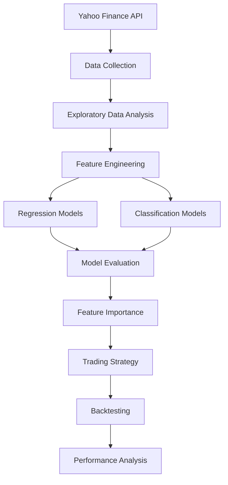

# Market Forecasting using Machine Learning

An end-to-end Machine Learning pipeline for stock market forecasting using Apple (AAPL) historical stock data from Yahoo Finance.

---

# 1. Project Highlights

- Downloaded 10 years of historical stock data using Yahoo Finance
- Performed Exploratory Data Analysis (EDA)
- Engineered 30+ technical indicators and statistical features
- Implemented Time-Series Cross Validation
- Built both Regression and Classification pipelines
- Compared multiple Machine Learning models
- Performed Feature Importance Analysis
- Built and evaluated a rule-based trading strategy
- Compared strategy performance against Buy & Hold

---

# 2. Project Workflow



---

# 3. Machine Learning Pipeline

```text
Yahoo Finance
      │
      ▼
Download Historical Data
      │
      ▼
Exploratory Data Analysis
      │
      ▼
Feature Engineering
      │
      ▼
Regression Models
      │
      ▼
Classification Models
      │
      ▼
Feature Importance
      │
      ▼
Trading Strategy
      │
      ▼
Backtesting
```

---

# 4. Project Structure

(keep your folder structure)

---

# 5. Dataset

Source: Yahoo Finance

Ticker: AAPL

Time Period: January 2015 – January 2025

---

# 6. Feature Engineering

(keep the existing content)

---

# 7. Machine Learning Models

## 7.1 Regression Models

## 7.2 Return Forecasting

## 7.3 Classification Models

---

# 8. Model Performance

## 8.1 Price Forecasting

## 8.2 Return Forecasting

## 8.3 Classification Results

---

# 9. Trading Strategy Backtest

(keep the existing table)

---

# 10. Visualizations

## 10.1 Closing Price

## 10.2 Daily Returns

## 10.3 Feature Importance

## 10.4 Backtest Equity Curve

---

# 11. Technologies Used

- Python
- Pandas
- NumPy
- Matplotlib
- Scikit-learn
- XGBoost
- LightGBM
- TA Library
- yfinance
- Joblib

---

# 12. Key Findings

(keep your existing findings)

---

# 13. Future Improvements

(keep your existing list)

---

# 14. Installation

(keep the commands)

---

# 15. Usage

(keep all the commands)

---


