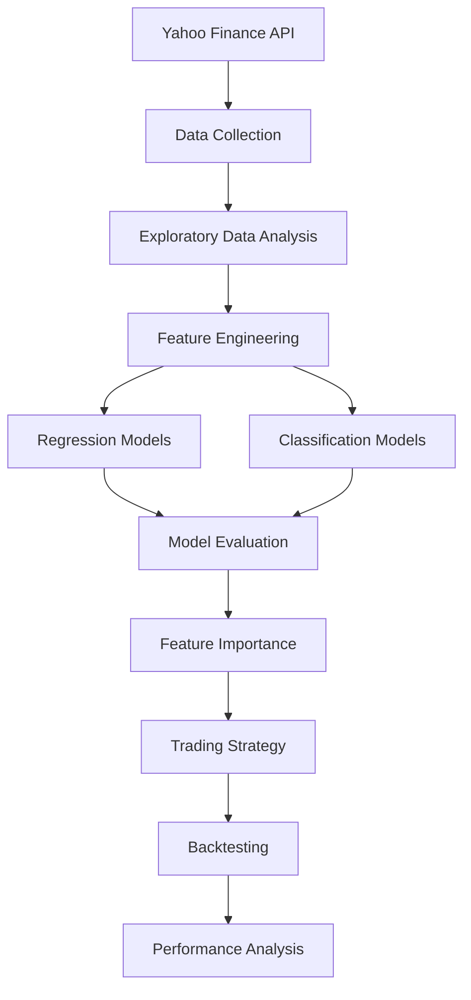

# 📈 Market Forecasting using Machine Learning

An end-to-end Machine Learning pipeline for stock market forecasting using **Apple (AAPL)** historical stock data from **Yahoo Finance**. This project explores price forecasting, return forecasting, market direction classification, feature engineering, and trading strategy backtesting using multiple machine learning algorithms.

---

# 🚀 Project Highlights

- ✅ Downloaded 10 years of historical stock data using Yahoo Finance
- ✅ Performed Exploratory Data Analysis (EDA)
- ✅ Engineered 30+ technical indicators and statistical features
- ✅ Implemented Time-Series Cross Validation
- ✅ Built both Regression and Classification pipelines
- ✅ Compared multiple Machine Learning models
- ✅ Performed Feature Importance Analysis
- ✅ Built and evaluated a rule-based trading strategy
- ✅ Compared strategy performance against Buy & Hold

---

# 🏗 Project Workflow



---

# 🔄 Machine Learning Pipeline

```text
Yahoo Finance
      │
      ▼
Download Historical Data
      │
      ▼
Exploratory Data Analysis
      │
      ▼
Feature Engineering
      │
      ▼
Regression Models
      │
      ▼
Classification Models
      │
      ▼
Feature Importance
      │
      ▼
Trading Strategy
      │
      ▼
Backtesting
```

---

# 📂 Project Structure

```text
market-forecasting-ml/
│
├── data/
│   ├── raw/
│   │   └── AAPL.csv
│   └── processed/
│       └── AAPL_features.csv
│
├── models/
│   ├── linear_regression.pkl
│   ├── random_forest.pkl
│   ├── xgboost.pkl
│   ├── lightgbm.pkl
│   ├── random_forest_classifier.pkl
│   ├── xgboost_classifier.pkl
│   └── lightgbm_classifier.pkl
│
├── reports/
│   ├── closing_price.png
│   ├── volume.png
│   ├── daily_returns.png
│   ├── random_forest_feature_importance.png
│   ├── backtest_equity_curve.png
│   ├── model_results.csv
│   ├── classification_results.csv
│   ├── return_model_results.csv
│   └── backtest_results.csv
│
├── src/
│   ├── data_loader.py
│   ├── eda.py
│   ├── feature_engineering.py
│   ├── train.py
│   ├── models.py
│   ├── train_classifier.py
│   ├── feature_importance.py
│   ├── backtest.py
│   ├── plot_backtest.py
│   ├── predict.py
│   └── __init__.py
│
├── requirements.txt
├── README.md
├── LICENSE
└── .gitignore
```

---

# 📊 Dataset

**Source:** Yahoo Finance

**Ticker:** AAPL (Apple Inc.)

**Time Period:** January 2015 – January 2025

---

# ⚙ Feature Engineering

The following technical indicators and statistical features were created:

### Trend Indicators
- Simple Moving Average (SMA 10, 20, 50)
- Exponential Moving Average (EMA 10, 20)

### Momentum Indicators
- Relative Strength Index (RSI)
- MACD

### Volatility Indicators
- Bollinger Bands
- Rolling Standard Deviation
- Historical Volatility

### Statistical Features
- Daily Returns
- Rolling Mean
- Momentum Returns
- Lag Features (1,2,3,5,10,20 days)

---

# 🤖 Machine Learning Models

## Regression Models

- Linear Regression
- Random Forest Regressor
- XGBoost Regressor
- LightGBM Regressor

### Regression Target

Predict the **next day's stock price**.

---

## Return Forecasting

Predict the **next day's stock return**.

Models:

- Random Forest
- XGBoost
- LightGBM

---

## Classification Models

Predict whether the **next day's return will be positive or negative**.

Models:

- Logistic Regression
- Random Forest Classifier
- XGBoost Classifier
- LightGBM Classifier

---

# 📈 Model Performance

## Price Forecasting

| Model | RMSE | R² |
|------|------:|------:|
| Linear Regression | **4.47** | **0.9647** |
| Random Forest | 33.14 | -0.939 |
| XGBoost | 35.45 | -1.219 |
| LightGBM | 35.08 | -1.172 |

---

## Return Forecasting

| Model | MAE | RMSE | R² |
|------|------:|------:|------:|
| Random Forest | **0.0113** | **0.0148** | **-0.264** |
| XGBoost | 0.0133 | 0.0169 | -0.636 |
| LightGBM | 0.0162 | 0.0198 | -1.246 |

---

## Classification Results

| Model | Accuracy | ROC-AUC |
|------|---------:|---------:|
| Logistic Regression | **56.2%** | **0.507** |
| Random Forest | 44.3% | 0.495 |
| XGBoost | 44.8% | 0.517 |
| LightGBM | 44.3% | 0.510 |

---

# 💹 Trading Strategy Backtest

Trading Rule:

- Buy when the classifier predicts a positive return.
- Stay in cash otherwise.

## Backtesting Results

| Metric | Value |
|---------|------:|
| Strategy Return | **-12.07%** |
| Buy & Hold Return | **806.29%** |
| Trades Executed | **1084** |
| Win Rate | **50.65%** |

---

# 📊 Visualizations

## Closing Price


---

## Daily Returns


---

## Feature Importance


---

## Backtest Equity Curve


---

# 📚 Technologies Used

- Python
- Pandas
- NumPy
- Matplotlib
- Scikit-learn
- XGBoost
- LightGBM
- TA (Technical Analysis Library)
- yfinance
- Joblib

---

# 🔍 Key Findings

- Linear Regression achieved high performance for price prediction because stock prices exhibit strong autocorrelation.
- Predicting short-term returns and market direction using only technical indicators proved significantly more challenging.
- The rule-based trading strategy underperformed a Buy & Hold strategy, highlighting the difficulty of short-term market prediction.
- The project demonstrates an end-to-end quantitative machine learning workflow, including data acquisition, feature engineering, model evaluation, interpretability, and backtesting.

---

# 🚀 Future Improvements

- Hyperparameter Optimization (Optuna)
- LSTM-based Time Series Forecasting
- Transformer-based Financial Forecasting
- Portfolio Optimization
- Reinforcement Learning for Trading
- Financial News Sentiment Analysis
- Alternative Data Integration
- Multi-Asset Portfolio Forecasting
- Live Market Prediction Dashboard using Streamlit

---

# ⚡ Installation

```bash
git clone https://github.com/Pushyamithra03/market-forecasting-ml.git

cd market-forecasting-ml

python -m venv venv

source venv/bin/activate

pip install -r requirements.txt
```

---

# ▶ Usage

Download stock data

```bash
python src/data_loader.py
```

Perform EDA

```bash
python src/eda.py
```

Generate Features

```bash
python src/feature_engineering.py
```

Train Models

```bash
python src/train.py
```

Train Classifier

```bash
python src/train_classifier.py
```

Feature Importance

```bash
python src/feature_importance.py
```

Backtesting

```bash
python src/backtest.py
```

Plot Equity Curve

```bash
python src/plot_backtest.py
```


