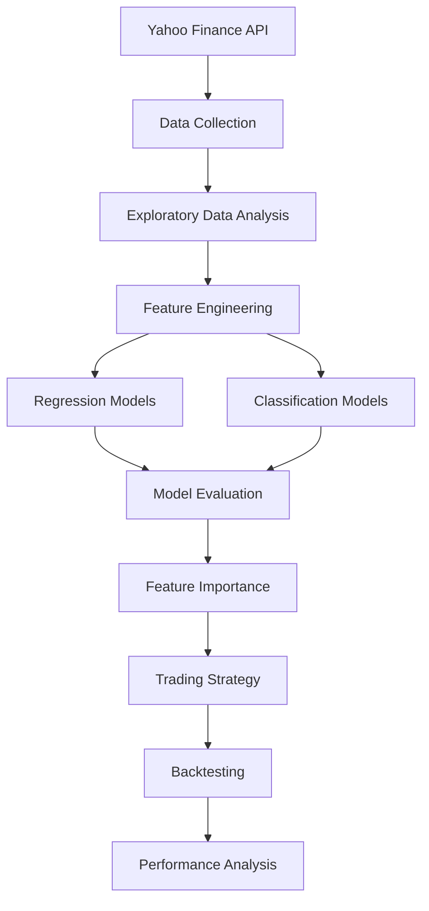
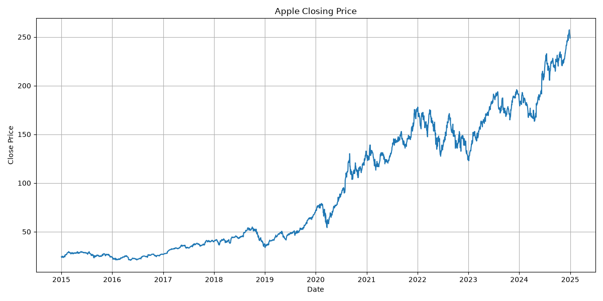
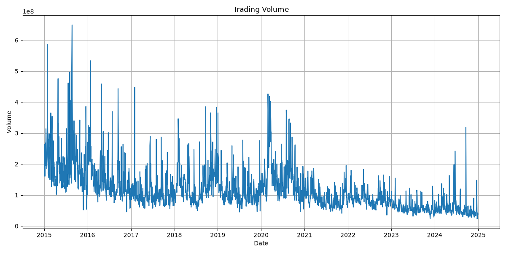
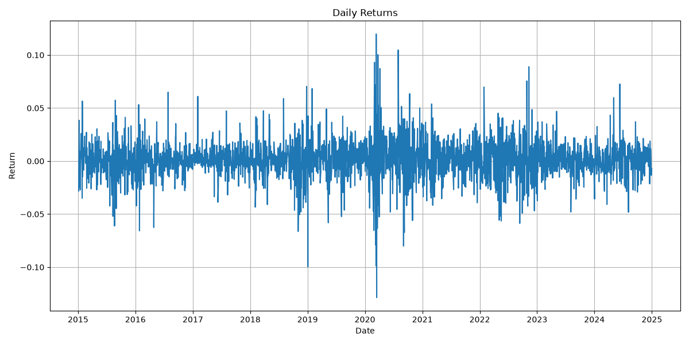
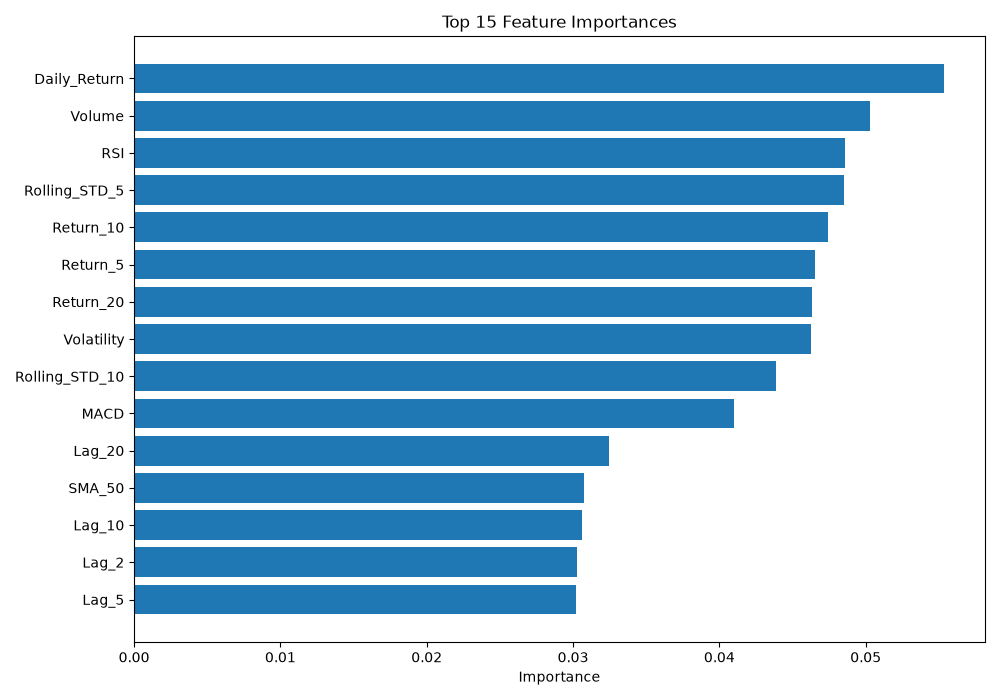
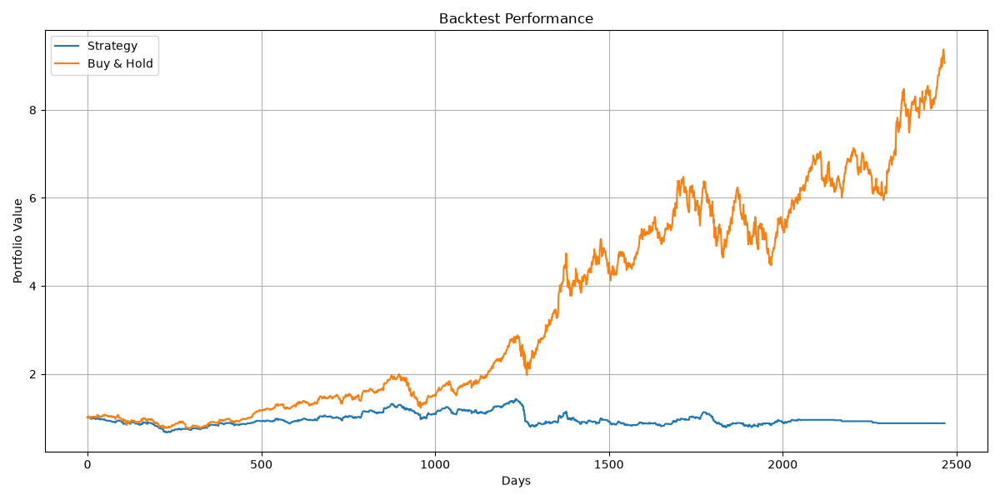

# Market Forecasting using Machine Learning

An end-to-end Machine Learning pipeline for forecasting stock market trends using historical Apple (AAPL) stock data from Yahoo Finance. The project includes data collection, feature engineering, regression and classification models, model evaluation, feature importance analysis, and trading strategy backtesting.

---

# 1. Project Highlights

- Downloaded historical stock data using Yahoo Finance
- Performed Exploratory Data Analysis (EDA)
- Engineered 30+ technical and statistical features
- Implemented Time-Series Cross Validation
- Compared multiple Machine Learning models
- Built regression and classification pipelines
- Performed feature importance analysis
- Backtested a trading strategy
- Compared strategy performance against Buy & Hold

---

# 2. Project Workflow



---

# 3. Machine Learning Pipeline

```text
Yahoo Finance
      │
      ▼
Historical Stock Data
      │
      ▼
Exploratory Data Analysis
      │
      ▼
Feature Engineering
      │
      ▼
Regression Models
      │
      ▼
Classification Models
      │
      ▼
Feature Importance
      │
      ▼
Trading Strategy
      │
      ▼
Backtesting
```

---

# 4. Project Structure

```text
market-forecasting-ml/
│
├── data/
│   ├── raw/
│   └── processed/
│
├── models/
│
├── notebooks/
│
├── reports/
│
├── src/
│
├── requirements.txt
├── README.md
├── LICENSE
└── .gitignore
```

---

# 5. Dataset

| Attribute | Value |
|-----------|-------|
| Source | Yahoo Finance |
| Stock | Apple (AAPL) |
| Time Period | 2015–2025 |

---

# 6. Feature Engineering

The following features were engineered:

### Trend Indicators

- Simple Moving Average (SMA)
- Exponential Moving Average (EMA)

### Momentum Indicators

- Relative Strength Index (RSI)
- MACD

### Volatility Indicators

- Bollinger Bands
- Historical Volatility

### Statistical Features

- Daily Returns
- Rolling Mean
- Rolling Standard Deviation
- Lag Features
- Momentum Returns

---

# 7. Machine Learning Models

## 7.1 Regression

- Linear Regression
- Random Forest Regressor
- XGBoost Regressor
- LightGBM Regressor

Target:

- Next Day Closing Price

---

## 7.2 Return Forecasting

- Random Forest
- XGBoost
- LightGBM

Target:

- Next Day Return

---

## 7.3 Classification

- Logistic Regression
- Random Forest Classifier
- XGBoost Classifier
- LightGBM Classifier

Target:

- Positive vs Negative Next-Day Return

---

# 8. Model Performance

## Price Forecasting

| Model | RMSE | R² |
|------|------:|------:|
| Linear Regression | 4.47 | 0.9647 |
| Random Forest | 33.14 | -0.939 |
| XGBoost | 35.45 | -1.219 |
| LightGBM | 35.08 | -1.172 |

---

## Return Forecasting

| Model | MAE | RMSE | R² |
|------|------:|------:|------:|
| Random Forest | 0.0113 | 0.0148 | -0.264 |
| XGBoost | 0.0133 | 0.0169 | -0.636 |
| LightGBM | 0.0162 | 0.0198 | -1.246 |

---

## Classification

| Model | Accuracy | ROC-AUC |
|------|---------:|---------:|
| Logistic Regression | 56.2% | 0.507 |
| Random Forest | 44.3% | 0.495 |
| XGBoost | 44.8% | 0.517 |
| LightGBM | 44.3% | 0.510 |

---

# 9. Trading Strategy Backtest

Trading Rule

- Buy when the model predicts a positive return.
- Stay in cash otherwise.

| Metric | Result |
|---------|--------:|
| Strategy Return | -12.07% |
| Buy & Hold Return | 806.29% |
| Trades | 1084 |
| Win Rate | 50.65% |

---

# 10. Visualizations

<table>

<tr>

<td align="center">

<b>Closing Price</b>

<br>



</td>

<td align="center">

<b>Trading Volume</b>

<br>



</td>

</tr>

<tr>

<td align="center">

<b>Daily Returns</b>

<br>



</td>

<td align="center">

<b>Feature Importance</b>

<br>



</td>

</tr>

<tr>

<td colspan="2" align="center">

<b>Backtesting Equity Curve</b>

<br>



</td>

</tr>

</table>

---

# 11. Technologies Used

- Python
- Pandas
- NumPy
- Matplotlib
- Scikit-learn
- XGBoost
- LightGBM
- TA Library
- yfinance
- Joblib

---

# 12. Key Findings

- Linear Regression achieved strong performance for next-day price prediction.
- Predicting next-day returns and market direction using technical indicators alone proved significantly more challenging.
- The trading strategy underperformed a Buy & Hold benchmark, highlighting the difficulty of short-term financial forecasting.
- The project demonstrates an end-to-end quantitative machine learning workflow, from data acquisition to model evaluation and backtesting.

---

# 13. Future Improvements

- Hyperparameter Optimization
- LSTM-based Forecasting
- Transformer Models
- Portfolio Optimization
- Reinforcement Learning
- Financial News Sentiment Analysis
- Multi-Asset Forecasting
- Live Dashboard using Streamlit

---

# 14. Installation

```bash
git clone https://github.com/Pushyamithra03/market-forecasting-ml.git

cd market-forecasting-ml

python -m venv venv

source venv/bin/activate

pip install -r requirements.txt
```

---

# 15. Usage

```bash
python src/data_loader.py

python src/eda.py

python src/feature_engineering.py

python src/train.py

python src/train_classifier.py

python src/feature_importance.py

python src/backtest.py

python src/plot_backtest.py
```

